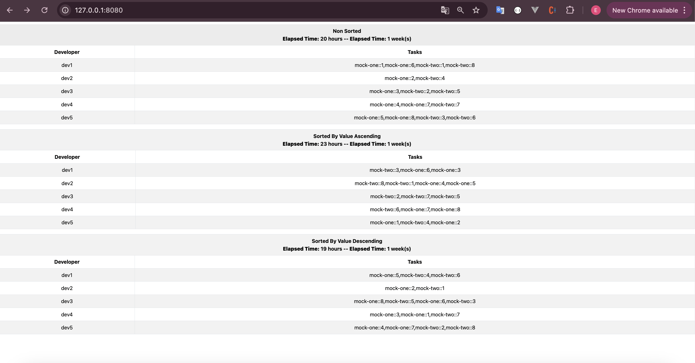

# Developer Planner

## Tech Stack

* PHP 8.2
* Laravel 11.9
* MySQL 8.0
* Nginx
* Docker 27.0.3
* Docker Compose 2.28.1

## Installation

Note: If you do not have docker daemon, install and run before.

1. Clone Repository and create local environment.

```shell
git clone https://github.com/akcauser/developer-planner.git
cd developer-planner
cp .env.example .env
docker-compose up -d
```

2. Be sure containers initialized. You can use this command. 

```shell
docker ps
```

3. Enter app container

```shell
docker exec -it developer-planner-app-1 bash
```

4. Install vendors, Create app key and run database migrations

```shell
composer install
php artisan key:generate
php artisan migrate
```

5. Fetch Mock Data

```shell
php artisan app:fetch-mock-data
```

6. Open http://127.0.0.1:8080



## Tests

Run command in app container to run tests.

```shell
php artisan test 
```

## Contributing Guide

* [Check Contributing Guide](./CONTRIBUTING.md).
